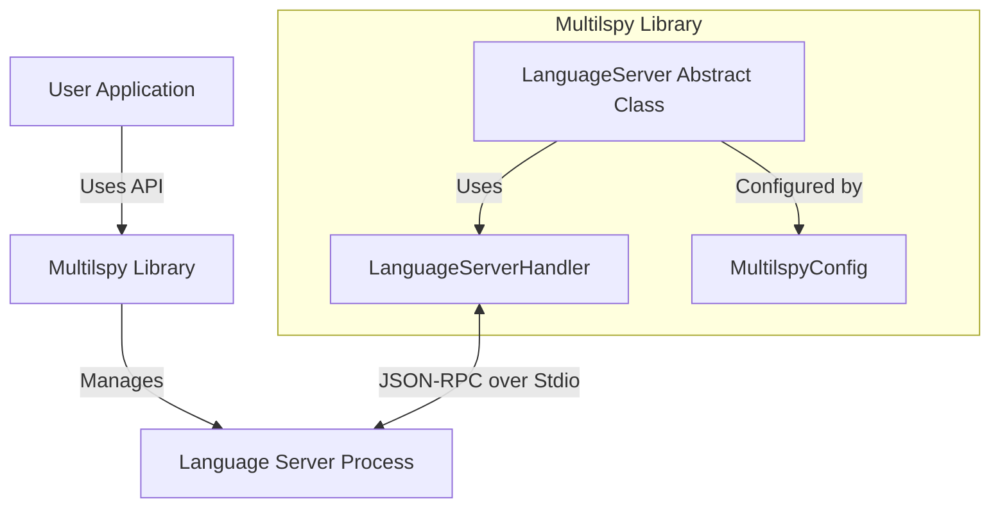
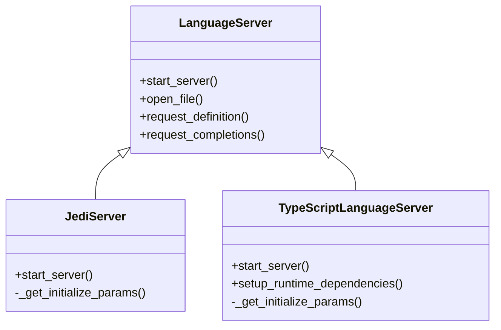

# Multilspy Architecture

## Introduction

`multilspy` is a cross-platform Python library designed to simplify the creation of Language Server Protocol (LSP) clients. It abstracts away the complexities of managing language server processes, handling JSON-RPC communication, and managing file synchronization, providing a unified API for querying various static analyses across multiple programming languages.

## High-Level Architecture

The architecture of `multilspy` revolves around a central `LanguageServer` abstraction that orchestrates the interaction between the user's application and the underlying language server executable.

## Core Abstractions

### 1. LanguageServer (`src/multilspy/language_server.py`)

This is the core abstract base class that defines the interface for all language server implementations. It provides:

*   **Lifecycle Management**: `start_server()` context manager to handle server startup and shutdown.
*   **File Management**: `open_file()`, `insert_text_at_position()`, `delete_text_between_positions()` to manage file buffers and synchronize them with the server.
*   **LSP Requests**: High-level methods for common LSP requests like `request_definition()`, `request_references()`, `request_completions()`, etc.
*   **Factory Method**: `create()` method to instantiate the appropriate language-specific server based on the configuration.

### 2. LanguageServerHandler (`src/multilspy/lsp_protocol_handler/server.py`)

This class handles the low-level details of the LSP communication. It is responsible for:

*   **Process Management**: Spawning and managing the language server subprocess.
*   **JSON-RPC**: Encoding and decoding JSON-RPC messages.
*   **Message Dispatch**: Routing incoming notifications and responses to the appropriate handlers.
*   **Concurrency**: Using `asyncio` to handle asynchronous communication with the server.

### 3. Configuration (`src/multilspy/multilspy_config.py` & `src/multilspy/multilspy_settings.py`)

*   **MultilspyConfig**: Holds configuration for a specific language server instance, such as the target language (`code_language`) and debugging options (`trace_lsp_communication`).
*   **MultilspySettings**: Manages global settings, primarily the location for storing downloaded language server binaries and caches.

## Language Server Implementations

Specific language support is implemented by subclassing `LanguageServer`. Examples include `JediServer` (Python), `TypeScriptLanguageServer` (TypeScript/JavaScript), `EclipseJDTLS` (Java), etc.

These subclasses are responsible for:

1.  **Runtime Setup**: Downloading and installing the necessary language server binaries and dependencies (e.g., via `npm` for TypeScript, or downloading JARs for Java).
2.  **Initialization**: Providing the language-specific initialization parameters (`InitializeParams`) required by the server.
3.  **Capability Registration**: Handling dynamic capability registration requests from the server.

## Key Workflows

### Server Initialization

1.  User calls `LanguageServer.create()` with a config.
2.  The factory method instantiates the specific subclass (e.g., `JediServer`).
3.  User enters the `start_server()` context manager.
4.  The subclass's `start_server()` is called.
5.  It calls `self.server.start()` to launch the subprocess.
6.  It sends the `initialize` request with language-specific parameters.
7.  It handles the `initialized` notification.
8.  The server is now ready to accept requests.

### Request Handling (e.g., Definition)

1.  User calls `lsp.request_definition(file_path, line, col)`.
2.  `LanguageServer` ensures the file is open (sending `textDocument/didOpen` if necessary).
3.  It sends a `textDocument/definition` request via `LanguageServerHandler`.
4.  `LanguageServerHandler` wraps the request in JSON-RPC and writes to the server's stdin.
5.  The server processes the request and writes the response to stdout.
6.  `LanguageServerHandler` reads the response, matches it to the request ID, and resolves the future.
7.  `LanguageServer` processes the response, converts it to `multilspy_types.Location` objects, and returns them.

## Directory Structure

*   `src/multilspy/`: Core library code.
    *   `language_server.py`: Main API and abstract base class.
    *   `lsp_protocol_handler/`: Low-level protocol handling.
    *   `language_servers/`: Language-specific implementations.
        *   `jedi_language_server/`: Python support.
        *   `typescript_language_server/`: TS/JS support.
        *   ... (other languages)
*   `tests/`: Test suite.
